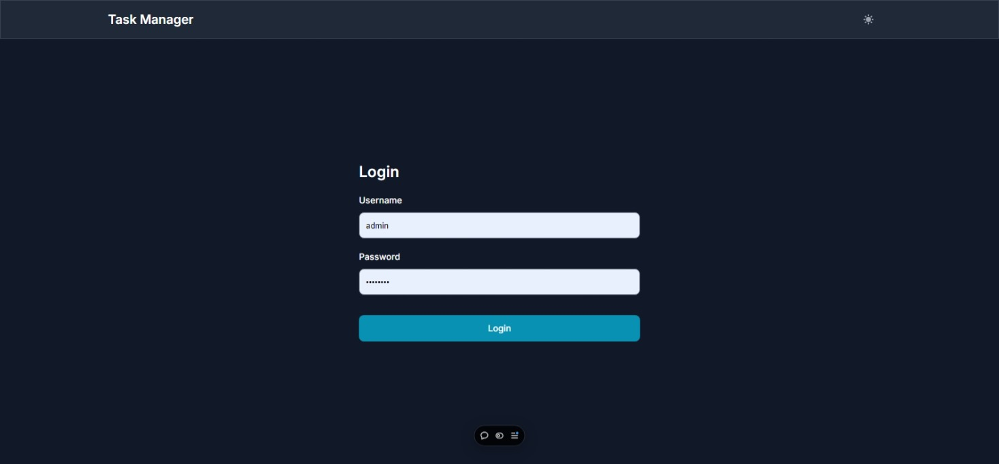
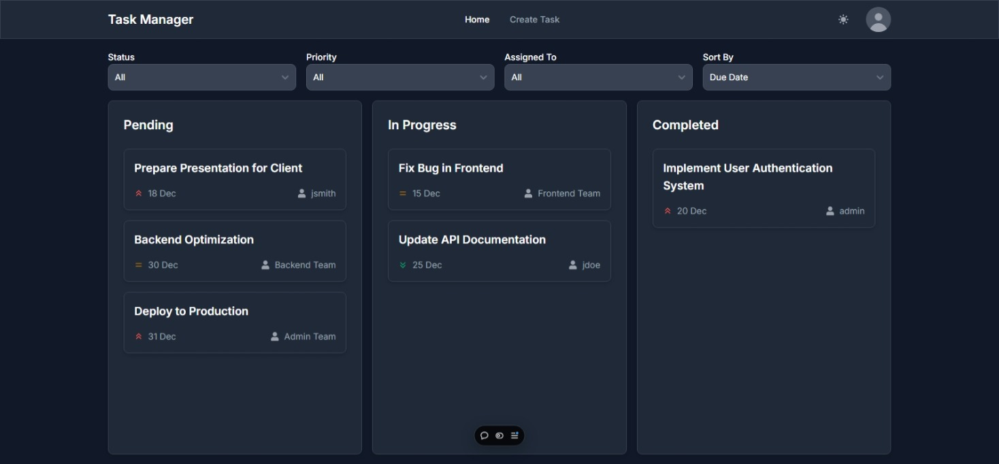
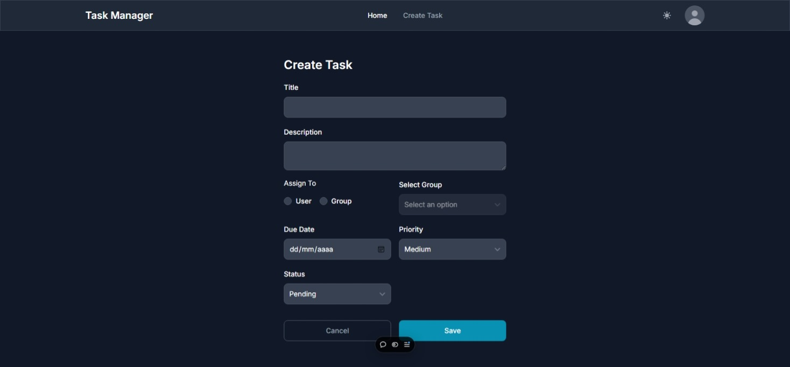
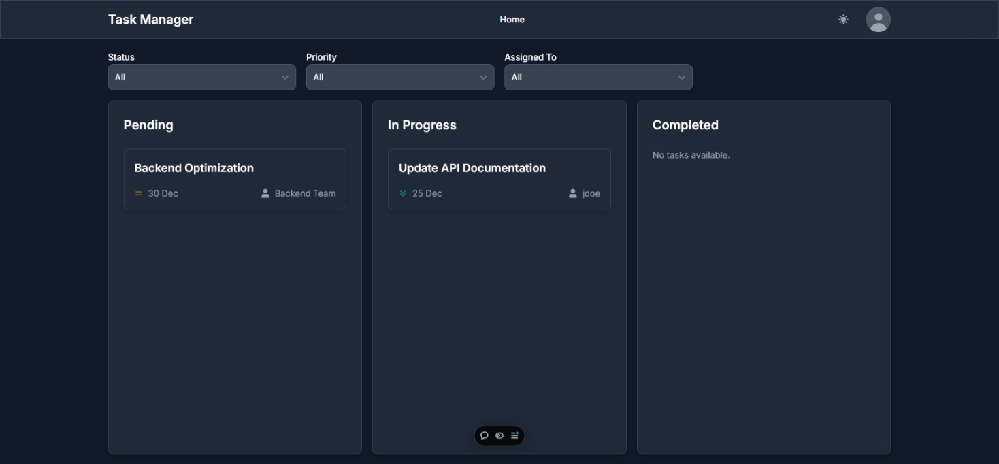
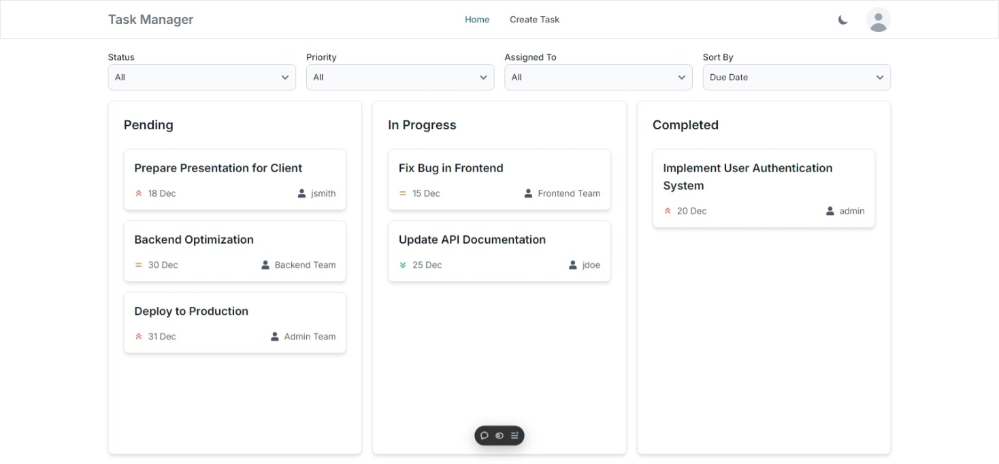

# Task Management System

The **Task Management System** is a web application designed to help users efficiently create, assign, and manage tasks. Built using **Next.js**, **Tailwind CSS**, and **Flowbite**, it offers a user-friendly interface and robust features tailored for both Admin and Regular users. This system streamlines task management, enhancing productivity and collaboration within teams.

## 🌐 Access the Application

You can access the production application at the following link: [Task Management System](https://tms-tool.vercel.app)

## 📸 Screenshots

### Login Page


_Login form interface._

### Dashboard


_Main dashboard view displaying the list of tasks._

### Task Creation (Admin)


_Form to create new tasks with all required fields._

### Task List (Regular User)


_List of tasks assigned to a regular user._

### Light/Dark Theme Toggle


_Interface in both light and dark themes._

## Main Technologies

- **Next.js 14**
- **Flowbite React**
- **Tailwind CSS**
- **Zustand** for global state management

## Features

### User Roles

1. **Admin User**:

   - Can create, assign, edit, and delete tasks.
   - Can view and manage all tasks.

2. **Regular User**:
   - Can view tasks assigned to them or their group.
   - Can mark tasks as **Completed** or **In Progress**.

### Core Functionalities

1. **Task Creation and Assignment (Admin Only)**:

   - Admin users can create tasks with fields for **title**, **description**, **assigned user/group**, **due date**, and **priority**.
   - Tasks can be assigned to specific users or groups.

2. **Viewing Tasks**:

   - Admin users can view all tasks and filter by **user**, **group**, or **status** (completed, pending).
   - Regular users can only view tasks assigned to them or their group.

3. **Managing Tasks (Regular Users)**:

   - Regular users can mark their assigned tasks as **Completed** or **In Progress**.
   - Users can add comments to tasks for better communication.

4. **Task Status Tracking**:

   - Tasks can have statuses: **Pending**, **In Progress**, and **Completed**.

5. **Filtering and Sorting Tasks**:

   - Users can filter tasks by **status**, **priority**, or **assigned user/group**.
   - Admin users can sort tasks by **due date**, **priority**, or **creation date**.

6. **Responsive User Interface**:

   - Built with **Tailwind CSS** and **Flowbite** to provide a clean and responsive design.
   - Includes a **light/dark theme toggle button** in the navbar, allowing users to select their preferred theme.

7. **Basic Authorization**:

   - Admin users can access task creation and management pages, while regular users can only access their assigned task list.

8. **Form Validation**:

   - Integrated form validation for login, task creation, and task editing to ensure data integrity and provide user feedback on errors.

9. **Route Protection and Authentication Middleware**:
   - Implemented middleware to protect routes and handle user authentication, ensuring that only authenticated users can access certain pages, with appropriate redirection based on their authentication status and roles.

## Getting Started

### Prerequisites

- **Node.js** 16+ and **npm** installed.

### Installation

To run the application locally, follow these steps:

1. **Clone the repository**:

   ```bash
   git clone https://github.com/Jonlle/task-management-system.git
   cd task-management-system
   ```

2. **Install dependencies**:

   ```bash
   npm install
   ```

3. **Create a `.env.local` file** for environment variables. Example:

   ```plaintext
   NEXT_PUBLIC_API_URL=http://localhost:3000
   ```

4. **Run the application**:

   ```bash
   npm run dev
   ```

## Running Tests

This project uses Jest for testing both the UI and API components. Below are the available scripts to run the tests:

### Run All Tests

To run both UI and API tests, use the following command:

```bash
npm test
```

### Run UI Tests

To run only the UI tests, use the following command:

```bash
npm run test:ui
```

### Run API Tests

To run only the API tests, use the following command:

```bash
npm run test:api
```

## Next Steps

1. **Database Integration**:
   Integrate a database like **SQLite** or **MongoDB** for persistent task storage, enhancing data management and reliability.

2. **Real-Time Updates**:
   Implement WebSocket support to provide real-time notifications when tasks are assigned or updated, improving user engagement.

3. **Drag-and-Drop Task Management**:
   Enhance user experience by allowing users to change task statuses using drag-and-drop functionality.

## Deployment

The application is deployed on **Vercel** for easy access. You can view the live version [here](https://tms-tool.vercel.app).

## License

This project is licensed under the terms of the [MIT License](./LICENSE).
